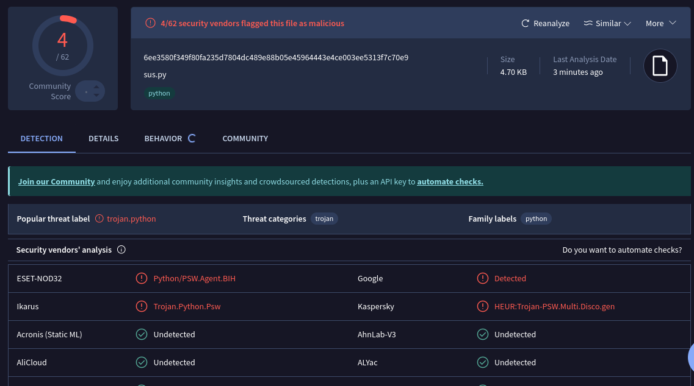
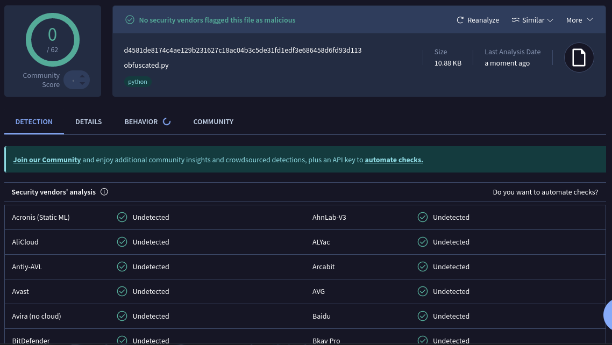

# Zeta-Obfuscator

Don't forget to support the project by rating it with a star on GitHub.

---

<p align="center">
  
</p>

---

## Zeta Obfuscator Tool

Python obfuscation tool that applies multiple stackable layers to protect your scripts. Obfuscated code remains **functionally identical** to the original (same behavior, same output). Output is compatible with `.py` execution and packaging (e.g. PyInstaller `.exe`).

---

## Why Choose Zeta?

- **Behavior-preserving** – Docstrings and runtime behavior are preserved so the obfuscated script produces the same result as the original.
- **5 obfuscation levels** – From Weak to Extreme; choose the level that fits your needs.
- **Multiple files at once** – Select or enter several Python files and obfuscate them in one run.
- **Flexible input** – Use the file picker or type path(s) manually (comma-separated for multiple files).
- **Anti-tampering** – Optional layer to detect modification of the obfuscated script.
- **No exotic dependencies** – Only `colorama` for the console UI; runs on Windows and Linux.

---

## Key Features

**5 stackable obfuscation layers:**

1. **Anti-tampering** – Detects unauthorized modification.
2. **Fake code injection** – Random fake code and variable names to confuse analysis.
3. **Dynamic ASCII shift** – Character-level encoding.
4. **Marshal + zlib** – Bytecode compilation and compression.
5. **Class-split + exec** – Code split into chunks and reassembled at runtime.  
   **Level 5 (Extreme)** adds a Base64/Zlib wrapper on top.

**Tool features:**

- Interactive console UI (colors via colorama).
- Single or multiple file selection (dialog or manual path entry).
- Same obfuscation level applied to all selected files.
- Output in `Zeta-Obfuscator/Script-Obfuscate/`.

---

## Obfuscation Levels

| Level | Name         | Description                          |
|-------|--------------|--------------------------------------|
| 1     | Weak         | Light obfuscation                    |
| 2     | Medium       | Moderate obfuscation                 |
| 3     | Strong       | Strong obfuscation                   |
| 4     | Very Strong  | Very strong obfuscation               |
| 5     | Extreme      | Very Strong + Base64/Zlib encapsulation |

---

## Quick Installation

```bash
git clone https://github.com/BenzoXdev/Zeta-Obfuscator.git
cd Zeta-Obfuscator
pip install -r requirements.txt
python Zeta-Obfuscator-Tool.py
```

**Requirements:** Python 3.8+ (3.10+ recommended for match/case and type union).  
**Dependencies:** `colorama` (see `requirements.txt`).

---

## Usage

1. Run `Zeta-Obfuscator-Tool.py`.
2. Choose one or more Python files (file dialog or type path(s) separated by commas).
3. Select obfuscation level (1–5).
4. Find obfuscated scripts in `Zeta-Obfuscator/Script-Obfuscate/`.

Original copies are saved in `Zeta-Obfuscator/Script/`.

---

## Recommended Use Cases

- Protecting automation or internal scripts.
- Distributing tools while making reverse engineering harder.
- Obfuscating business logic before delivery.
- Reducing readability of proprietary code.

---

## VirusTotal Comparison

**Without Zeta-Obfuscator:**



**With Zeta-Obfuscator:**



---

## Trust & Credibility

**Developer:** BenzoXdev  

- **Telegram:** [t.me/benzoXdev](https://t.me/benzoXdev)  
- **GitHub:** [github.com/BenzoXdev](https://github.com/BenzoXdev)  
- **Instagram:** [instagram.com/just._.amar_x1](https://instagram.com/just._.amar_x1)

---

## License & Usage

For educational and professional use only. The author is not responsible for any misuse of this tool. Use only on code you own or are authorized to obfuscate.
